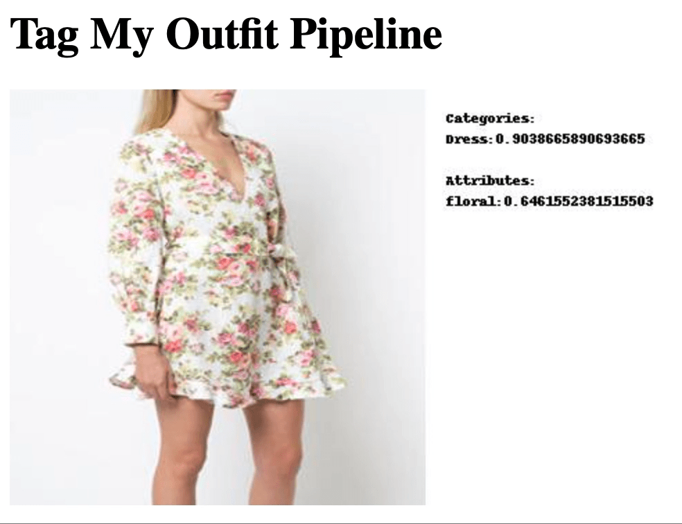

# Tag My Outfit Pipeline

## Overview

This repository provides a pipeline that, given an image classifies clothing parts within a set of attributes, as well as predicts their attributes.

The results are displayed with a web visualization interface.

<p align="center">
    
</p>

## Getting Started

The different stages of the pipeline are executed as docker containers, so you need to install [Docker](https://docs.docker.com/get-docker/) to run it.

The pipeline uses Docker-Compose *(installed by default with Docker)* to run the multiple containers.
The Docker images are published on DockerHub.

To run the pipeline, execute the following instructions:

* Start the pipeline *(all images will be downloaded from DockerHub)*:
 
 ```
 $ docker-compose up
 ```

* Open a browser window at http://localhost:5000 *(you may need to refresh some times until the first image appears)*

## Classifying your own images

The pipeline retrieves the images from the [images directory](images). 
You can replace the images inside the directory to classify your images.
